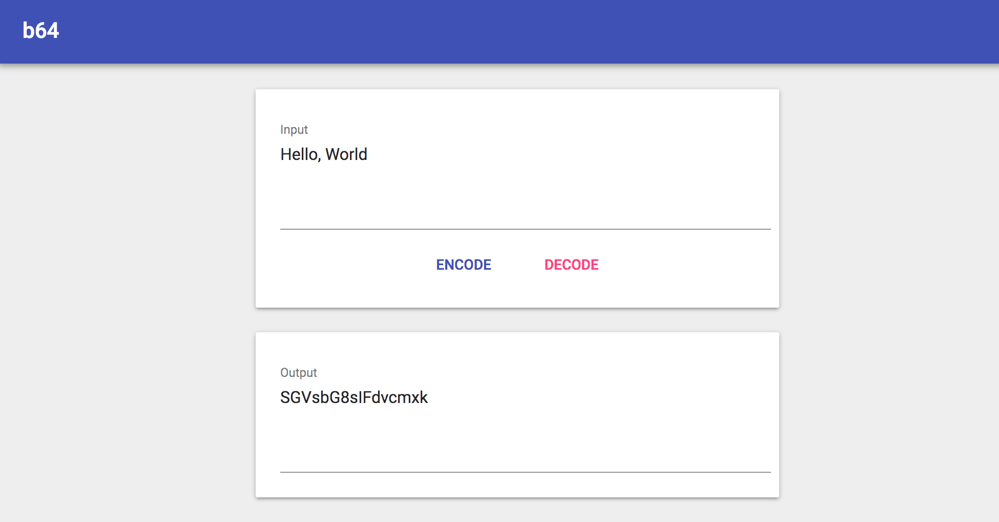

# b64
Base64 Encode/Decode Tool

## Install
```
$ yarn install
```

## Usage


### Running the app in development mode
```
$ yarn start
```

### Deploying to GitHub Pages
```
"homepage": "https://myusername.github.io/my-app",
```
Add a `homepage` field in `package.json`.

```
$ yarn run deploy
```
Deploy the app to `gh-pages` branch.


## License
MIT
